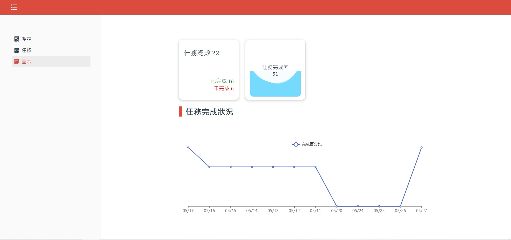
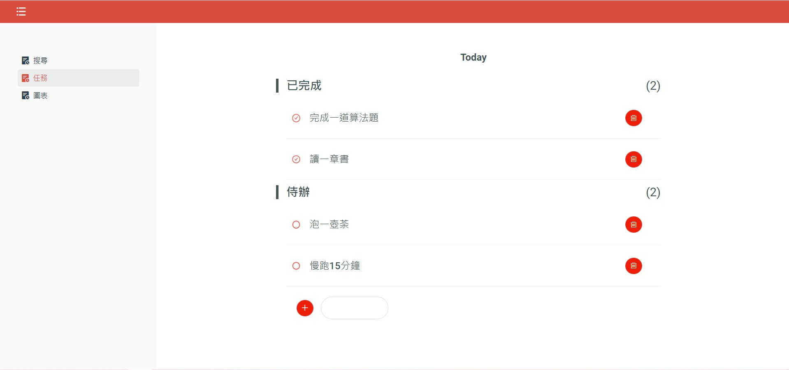

# vue全家桶 + echart 個人todolist聯動任務可視化

## Demo
https://kayelau.github.io/todolist/#/

## 技術亮點
- 以vuex實現狀態管理,以localstorage實現數據持久化保存
- 聯動圖表,根據任務情況生成可視化圖表
- 用vue封裝echart圖表,實現公共配置管理,只需用props傳入數據即可使用
- 自適應頁面

### 開發筆記

## 預覽圖

